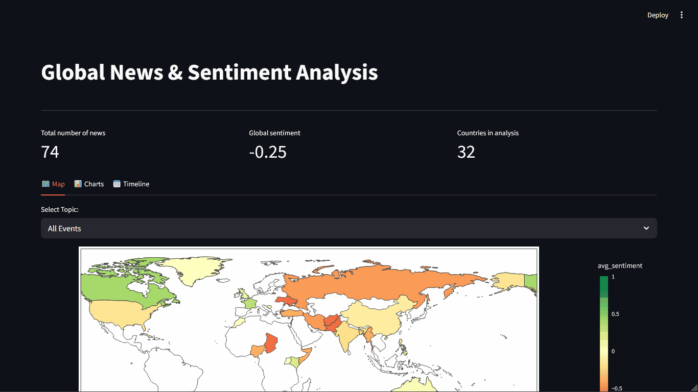
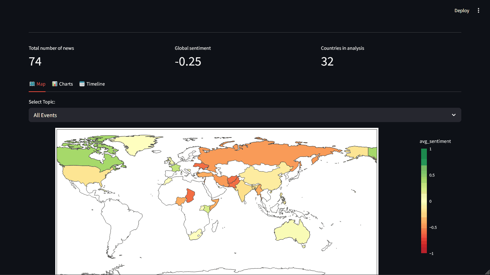

# News Intelligence Orchestrator
> ⚠️ **Note:** This is currently a Work In Progress (WIP) test project. It will be continually improved and rewritten more robustly in the future.


---

## Screenshots & Demo


*Demo 1: Interactive choropleth map of average news sentiment by country.*



*Demo 2: Country analysis in news.*

## Project Overview
The **News Intelligence Orchestrator** is an automated, end-to-end data pipeline and analytics platform designed to ingest, process, and analyze global news content. By unifying targeted RSS parsing, state-of-the-art Large Language Models (LLMs), text embeddings, and vector similarity search, the intelligence engine automatically categorizes articles, extracts geographic locations and named entities, and gauges sentiment. 

The project culminates in a rich, interactive frontend dashboard offering near real-time geographical maps, time-series analysis, and event tracking.

## Main Features
*   **Automated Data Ingestion:** Systematically fetches and parses content from global RSS feeds and web sources.
*   **Smart Deduplication:** Prevents redundant data processing by identifying and filtering out duplicate articles during the ingestion and database insertion phase (enforcing unique article URLs), ensuring clean data and optimal storage usage.
*   **Modular LLM Pipeline:** Supports configurable local and remote LLMs (via `llama-cpp-python`, Hugging Face, or OpenAI) to perform advanced NLP tasks: zero-shot classification, entity extraction, sentiment analysis, and event grouping.
*   **Customizable News Categories:** Thanks to the one-shot/zero-shot model, news categories are fully customizable. The user can choose exactly which news to parse and categorize by simply modifying the logic and prompts inside the llm_settings configuration files (e.g., `v1.yaml`).
*   **Semantic Vector Workloads:** Leverages sentence transformers to build vector embeddings of articles, storing them utilizing `pgvector` for fast semantic similarity search.
*   **Task Scheduling:** Built-in background worker leveraging `APScheduler` to run the intelligence pipeline continuously.
*   **Interactive Analytics Dashboard:** A comprehensive Streamlit interface highlighting global news trends, geographical sentiment maps, bar charts, and historical timelines.

## Tech Stack
*   **Language:** Python 3.11
*   **Database:** PostgreSQL 16 with the **`pgvector`** extension
*   **ORM & Migrations:** SQLAlchemy 2.0, Alembic
*   **Machine Learning / AI:** PyTorch (with CUDA 12.4 support), `transformers`, `sentence-transformers`, `llama-cpp-python`, OpenAI SDK
*   **Data & Visualization:** Streamlit, Pandas, Plotly, Altair, Pydeck
*   **CLI & Scheduling:** Typer, APScheduler
*   **Infrastructure:** Docker, Docker Compose (NVIDIA Toolkit)

## Architecture Overview
The system architecture follows a clean modular design pattern:
1.  **Ingestion Layer (ingestion):** Responsible for reaching out to predefined URLs/Feeds, parsing raw data, and pushing items to the queue.
2.  **Machine Learning Engine (ml & services):** Represents the core inference logic. It downloads necessary models, routes data sequentially through embedding encoders and LLMs (e.g., DeBERTa, Nomic-Embed), and updates categorized nodes.
3.  **Data Layer (database):** PostgreSQL handles both tabular relational data (sources, entities, tracking) and vector indices (`pgvector`). SQLAlchemy defines the object mapping, while Alembic applies migration scripts natively.
4.  **Presentation Layer (ui):** An isolated Streamlit application that pulls processed intelligence directly from the database to render visual metrics.
5.  **CLI Entrypoint (main.py):** Acts as the primary orchestrator, directing system execution to either run the dashboard, execute pipelines, or run as a scheduled daemon.

---

## Project Structure Overview

```text
news-intelligence-orchestrator/
├── main.py                  # Primary CLI application entry point
├── config.yaml              # Application configuration
├── docker-compose.yml       # Production-ready Docker Compose configurations
├── Dockerfile               # Application container build instructions
├── requirements.txt         # Python dependencies
├── alembic.ini              # Database migration config
├── llm_settings/            # Configurations for various LLM pipelines (v1-v4)
├── migrations/              # Database migration history and schema evolution
├── models/                  # Local cache for downloaded Hugging Face models
├── src/                     # Core application source code
│   ├── config/              # Centralized configuration and logging routines
│   ├── database/            # Database schema models and connection logic
│   ├── domain/              # Core domain logic (country and news analysis rules)
│   ├── ingestion/           # Feed scrapers and content parsers
│   ├── ml/                  # Abstractions for Local/Remote LLMs and Embeddings
│   ├── services/            # Glue codes mapping ML interactions to DB operations
│   ├── ui/                  # Streamlit dashboard and individual visual views
│   └── utils/               # Helper modules (constants, loaders)
└── tests/                   # Test suites (CLI, Services, Utils)
```

---

## Docker Setup & Usage

The application relies entirely on Docker deployments. All dependencies, CUDA setups, environment variable passing, and port mapping are contained inside Docker.

### Prerequisites
1.  **Docker & Docker Compose (V2)** installed on your machine.
2.  **NVIDIA GPU & Container Toolkit:** This project strictly **requires an NVIDIA GPU**. Because the inference layer uses PyTorch/CUDA 12.4 to accelerate LLMs, you must install the NVIDIA container toolkit to properly map GPU hardware down to the Docker container.

### Environment Variables
For most usage, standard values are passed via docker-compose.yml. However, if you are leveraging remote LLM modes, create a .env file at the repository root and provide the necessary secrets:

```dotenv
OPENAI_API_KEY=sk-your-openai-api-key
POSTGRES_USER=myuser
POSTGRES_PASSWORD=mypassword
POSTGRES_DB=news_db
```

### Docker Commands

**1. Build the Images**
Before running for the first time, or after making changes to requirements.txt or Dockerfile:
```bash
docker compose build
```

**2. Start the Environment**
Launch all background services (Database, Streamlit Dashboard, and PgAdmin):
```bash
docker compose up -d
```
*Note: The `app` service is designed to wait automatically for the `db` service to pass health checks. Upon initialization, it runs Alembic migrations (`alembic upgrade head`) to seed `pgvector` and all internal tables.*

**3. Check Service Logs**
To ensure the pipeline is booting correctly or to read the inference logs:
```bash
# View all logs
docker compose logs -f 

# View logs for the main application only
docker compose logs -f app
```

**4. Stop the Environment**
Shut down the deployed containers cleanly without wiping database volumes:
```bash
docker compose down
```
*(To wipe the database completely, removing volumes, run `docker compose down -v`)*

### Container Roles
*   `db`: Runs PostgreSQL 16 + pgvector. Exposed via `5433` depending on your compose configuration.
*   `app`: The primary Python service. Runs background tasks, executes the ML models (caches directly to a mounted models local volume), and serves the Streamlit dashboard on port `8501`.
*   `pgadmin`: An optional web UI for quickly inspecting database tables, accessible via `http://localhost:8080`.

---

## Command Line Interface (CLI)
Inside the `app` Docker container or in local development workflows, you can utilize the Typer CLI in main.py.

You can access these commands via your Docker container:
```bash
docker compose exec app python main.py --help
```

**Run a single Intelligence Pipeline:**
Executes one single ingestion, enrichment, and analysis pass, then exits.
```bash
python main.py run
```

**Start the Continuous Scheduler:**
Starts the `APScheduler` routine to perform endless repeating pipeline workloads globally.
```bash
python main.py scheduler
```

**Launch the Dashboard Manually:**
If running without compose, launch the Streamlit server on `http://localhost:8501`.
```bash
python main.py dashboard --port 8501 --no-browser
```

---

### Running Tests
A Pytest suite is provided. To execute tests for the CLI, services, and utils:
```bash
pytest tests/ -v
```

---

## Troubleshooting

-   **Model takes too long to load / out of memory:** This is usually due to insufficient VRAM. Try disabling GPU layers for `llama-cpp-python` or switch your config.yaml to utilize a smaller LLM model, or the remote OpenAI integration.
-   **Database initialization failures:** The Python process starts before PostgreSQL accepts connections. docker-compose.yml likely contains health check delays, but if Alembic fails on boot, manually restart the app container (`docker compose restart app`).
-   **Dashboard mapping components not rendering:** Ensure `pydeck` and `plotly` dependencies aren't blocked by your browser's CORS/JavaScript blockers.